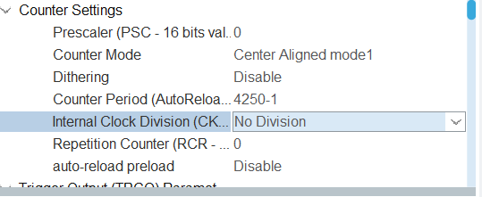
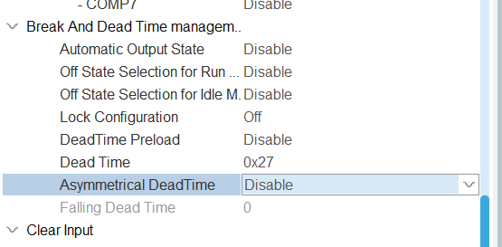
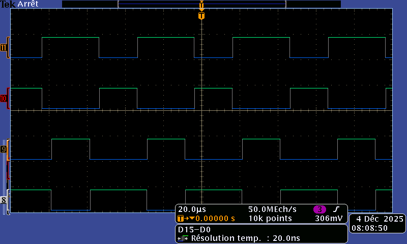
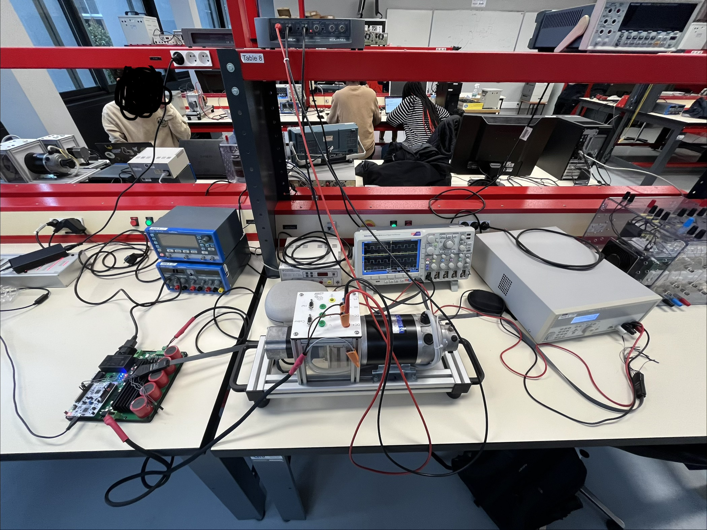

# 1. 2526_ESE_AAA_CORDI_THEBAULT
Etudiants : Nelven THEBAULT, Hugo CORDI

Encadarant : Alexis MARTIN

## 1.1 Description du projet
Ce dépôt contient le travail réalisé dans le cadre du **TP de 3A d'Actionneur et automatique appliquée**.  
A partir d'un hacheur complet et d'une carte Nucleo-STM32G474RE on a 3 séances pour : 
- Réaliser la commande des 4 transistors du hacheur en commande complémentaire décalée
- Faire l'acquisition des différents capteurs
- Réaliser l'asservissement en temps réel

## 1.2 Sommaire


- [1. 2526_ESE_AAA_CORDI_THEBAULT](#1-2526_ese_aaa_cordi_thebault)
  - [1.1 Description du projet](#11-description-du-projet)
  - [1.2 Sommaire](#sommaire)
  - [1.3 Commande MCC basique](#12-commande-mcc-basique)
    - [1.3.1 Génération de 4 PWM](#131-génération-de-4-pwm)
    - [1.3.2 Commande de vitesse](#132-commande-de-vitesse)
    - [1.3.3 Premiers tests](#133-premiers-tests)
  - [1.4 Commande en boucle ouverte, mesure de vitesse et de courant](#14-commande-en-boucle-ouverte-mesure-de-vitesse-et-de-courant)
    - [1.4.1 Commande de la vitesse](#141-commande-de-la-vitesse)
    - [1.4.2 Mesure de courant](#142-mesure-de-courant)
    - [1.4.3 Mesure de vitesse](#143-mesure-de-vitesse)


### 1.3.1 génération de 4 PWM

Générer quatre PWM sur les bras de pont U et V pour controler le hacheur à partir du timer déjà attribué sur ces pins.

Cahier des charges :
- Fréquence de la PWM : 20kHz ➡ TIM_1 à 170 kHz donc met PSC = 1 et ARR = 8500 or on passe en center aligned en mode 3 donc met dans l'ioc ARR=4250-1

- Temps mort minimum : à voir selon la datasheet des transistors
  - Dans le datasheet des transistors on prend le pire cas entre rise time et delay time / fall time and delay time / recover time
     
    - Le recover time est le plus long et on le prend x2 comme sécurité donc $t_{DT}=230 ns$
  - Ensuite on le configure dans l'ioc via les bits DTG[7:0] du timer1
    
    - 230 ns étant très petit on se place au DTG avec le bit de poids fort à 0 donc on a la formule $\boxed{DT =DTG\times t_{tim1}}$ donc $DTG = \dfrac{230}{5.88}=39$ = `0x27`
    
- Résolution minimum : 10bits ➡ 1024-1 or notre ARR est à 4500.
Pour les tests, on fixe le rapport cyclique à 60% via 
```c
code motor
```

Une fois les PWM générées, on les affiche sur un oscilloscope :


Où :
- `8` ➡ `CH1`
- `9` ➡ `CH1N`
- `10` ➡ `CH2`
- `11` ➡ `CH2N`

On retouve bien une commande complémentaire décalée 

## 1.3.2 commande de vitesse

## 1.3.3 Premiers tests

- On test via notre shell en passant de 50% à 55% puis 60%, le moteur tourne dans un sens
- Puis on revient progressivement à 50%, et on passe à 40% aussi progressivement et le moteur tourne bien dans l'autre sens 



- On envoie que 2 A max